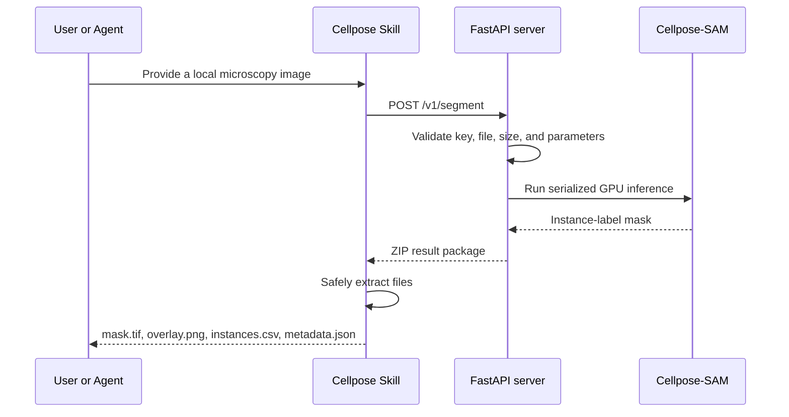

[**English**](README.md) | [简体中文](README.zh-CN.md)

# Cellpose Skill and GPU Inference Service

A deployable Cellpose-SAM toolkit for 2-D microscopy instance segmentation. The server loads the model on a GPU and exposes a validated HTTP API; the bundled Agent Skill uploads local images and returns quantitative labels, a QA overlay, per-instance measurements, and traceable metadata.

The model choice is grounded in a controlled comparison of Cellpose-SAM, MicroSAM DeepBacs, Omnipose, and a conventional image-processing workflow. See [`bacterial-segmentation-benchmark`](https://github.com/desperati0n/bacterial-segmentation-benchmark) for the data audit, metrics, report, and four-model gallery.

## Architecture



The inference endpoint is a standard REST service, not an MCP server. `/mcp` and `/.well-known/...` returning `404` is expected; use `/healthz` and `/v1/segment`.

## Repository layout

```text
cellpose-kit/
├── README.md / README.zh-CN.md
├── cellpose-server/
│   ├── app.py                 FastAPI API and Cellpose inference
│   ├── cellpose_config.py     Server configuration loader
│   ├── healthcheck.py         Container health check
│   ├── Dockerfile
│   ├── compose.yaml           GPU, ports, and model volume
│   ├── requirements.txt
│   ├── .env.example / .env.example.zh-CN
│   └── DEPLOY*.md             English and Chinese deployment guides
└── cellpose-segmentation/
    ├── SKILL.md               Executable English Agent instructions
    ├── SKILL.zh-CN.md         Chinese reference translation
    ├── cellpose_config.py
    ├── scripts/segment.py     Upload, download, and safe extraction
    ├── references/
    ├── agents/openai.yaml
    └── .env.example / .env.example.zh-CN
```

## Request lifecycle

1. The Agent identifies a 2-D microscopy instance-segmentation request from `SKILL.md`.
2. `scripts/segment.py` reads the service URL, API key, timeout, and default parameters from the Skill's `.env`.
3. The image is uploaded as multipart field `file` to `/v1/segment`.
4. The server validates extension, size, authentication, dimensions, and parameter ranges, then records the input SHA-256.
5. A startup-loaded Cellpose model runs inference. Requests are serialized within one process to reduce GPU-memory contention.
6. The server creates the label mask, per-instance table, metadata, and QA overlay and returns them as a ZIP archive.
7. The client validates and safely extracts the archive, prints a compact JSON summary, and removes the temporary ZIP unless `--keep-zip` is set.

## Input

Supported extensions: `.png`, `.jpg`, `.jpeg`, `.bmp`, `.tif`, and `.tiff`.

Decoded input must be a 2-D grayscale image or a 2-D image with channels. Higher-dimensional data that cannot be interpreted as a 2-D segmentation input is rejected. Maximum upload size is controlled by `CELLPOSE_MAX_UPLOAD_MB` and defaults to 256 MB.

### Segmentation parameters

| Parameter | Meaning |
|---|---|
| `cellprob_threshold` | Lower values usually retain more candidate foreground; higher values remove low-confidence regions |
| `flow_threshold` | Flow-consistency filter; higher is more permissive and lower is stricter |
| `min_size` | Minimum instance area in pixels |
| `diameter` | Estimated cell diameter in pixels; empty means automatic/default handling |
| `normalize` | Normalize image intensity before inference |
| `invert` | Reverse bright/dark polarity |

## Output contract

| File | Purpose |
|---|---|
| `mask.tif` | Quantitative `uint32` instance-label raster. `0` is background; each positive integer is one per-image instance ID |
| `overlay.png` | 8-bit RGB visual-QA image with deterministic colors and white boundaries; never use it for quantitative intensity or area measurements |
| `instances.csv` | One row per instance, containing the integer `label` and `area_px` |
| `metadata.json` | Authoritative run record: versions, model, device, input hash/shape, instance count, latency, effective parameters, and overlay status |

Positive mask values are arbitrary image-local identifiers—not biological classes, confidence scores, or stable IDs across runs. `area_px` is measured in pixels and requires pixel-size metadata for physical units.

The client also prints a JSON summary containing the output directory, model, instance count, inference time, and filenames. Persistent provenance lives in `metadata.json`.

## Deploy the server

Requirements:

- Docker Engine or Docker Desktop;
- Docker Compose;
- NVIDIA driver;
- NVIDIA Container Toolkit;
- network access needed to build dependencies and obtain the configured model on first startup.

```bash
cd cellpose-server
cp .env.example .env
# Edit .env before starting.
docker compose --env-file .env up --build -d
docker compose --env-file .env ps
docker compose --env-file .env logs -f cellpose
```

Verify from inside the container:

```bash
docker compose --env-file .env exec cellpose python healthcheck.py
```

Verify from the host:

```bash
curl http://127.0.0.1:8000/healthz
```

Interactive API documentation is available at `http://127.0.0.1:8000/docs`. The root path is intentionally undefined; `GET /` returning `404` is not a health failure.

See the [deployment guide](cellpose-server/DEPLOY.md) for operational and security details.

## Install and call the Skill

Install the complete `cellpose-segmentation` directory in an Agent environment that supports Skills. Copy its `.env.example` to `.env` and configure the existing service URL and matching API key.

```bash
python scripts/segment.py "path/to/sample.tif" --output "path/to/sample_cellpose"
```

If `--output` is omitted, the default directory is `<input-stem>_cellpose` beside the input. A nonempty output directory is rejected to prevent accidental overwrite; use another directory or explicitly add `--force`.

Override parameters for one request:

```bash
python scripts/segment.py "sample.tif" --output "result" \
  --cellprob-threshold -0.2 --flow-threshold 0.5 \
  --min-size 30 --diameter 50
```

Retain the response archive with `--keep-zip`.

## HTTP API

### `GET /healthz`

Returns service status, version, model name, and inference device. Repeated `200 OK` requests are expected because Docker uses this endpoint for health checks.

### `POST /v1/segment`

Accepts `multipart/form-data`. The image field must be named `file`; segmentation parameters are optional. A successful response is `application/zip` and includes response headers for model name and instance count.

## Configuration and secrets

The server and Skill each read `.env` from their own directory. Settings use this precedence, from lowest to highest:

1. distributable defaults in `.env.example`;
2. local values in `.env`;
3. process environment variables.

When authentication is enabled, `CELLPOSE_API_KEY` must match on both sides. Leave it empty on both sides to disable key authentication. Never commit a real `.env`, API key, or public server credential.

## Common statuses

| Symptom/status | Meaning or action |
|---|---|
| `POST /v1/segment 200` | Segmentation succeeded |
| `GET /healthz 200` | Normal health check |
| `401` | API key missing or mismatched |
| `413` | Upload exceeds `CELLPOSE_MAX_UPLOAD_MB` |
| `415` | Unsupported extension |
| `422` | Missing `file`, unsupported dimensions, or invalid parameter |
| `500` | Inference or packaging failure; inspect container logs |
| `GET / 404` | Expected; use `/healthz` or `/docs` |
| `POST /mcp 404` | Client treated the REST API as MCP; call `/v1/segment` through the Skill |
| Container remains `starting` | Model may still be downloading/loading; inspect logs |
| Nonempty output directory rejected | Choose a new directory or intentionally use `--force` |
| Missing `overlay.png` | Preview could not be represented as compatible 2-D display data; inspect `metadata.json` |

## Security boundary

The default binding is intended for local access. For remote use, expose the service only through a protected private network or a TLS-enabled reverse proxy and configure a strong API key. Do not expose an unencrypted, unauthenticated inference port directly to the public internet.
