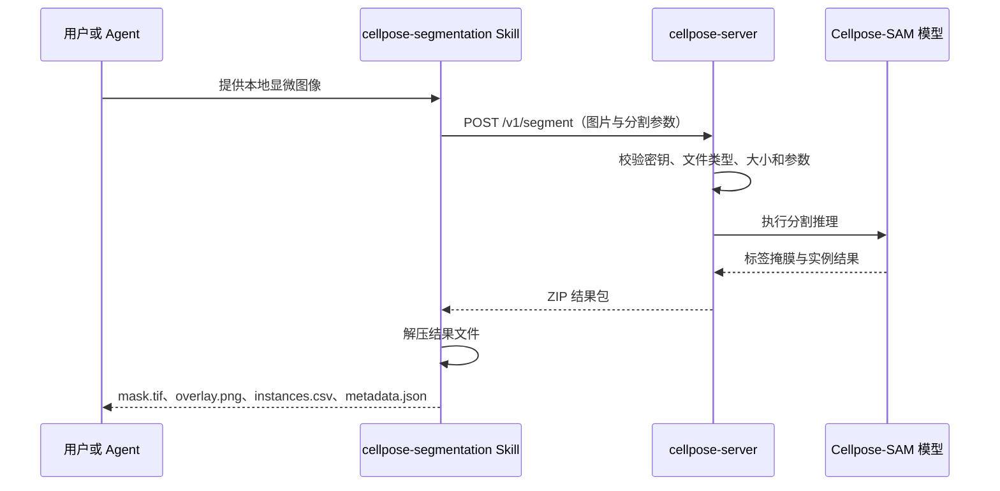

# Cellpose Skill 与服务端技术说明

## 1. 项目简介

此 Skill 使用 Cellpose-SAM、PyTorch 和 Docker 提供的服务，为二维显微图像进行细胞实例分割。服务端在 GPU 环境中加载模型并完成分割；Skill 负责将本地图片发送到服务端，再把掩膜、预览图和统计结果返回给使用者或其他 Agent。

## 2. 目录结构

```text
cellpose-kit/
├── README.md                        本文档
├── cellpose-server/                 服务端部署包
│   ├── app.py                       FastAPI 服务与 Cellpose 推理逻辑
│   ├── cellpose_config.py           服务端配置读取器
│   ├── healthcheck.py               Docker 健康检查脚本
│   ├── Dockerfile                   服务端镜像构建规则
│   ├── compose.yaml                 容器、端口、GPU 和模型卷配置
│   ├── requirements.txt             服务端 Python 依赖及版本
│   ├── .env.example                 可分发的服务配置模板
│   └── DEPLOY.md                    简明部署说明
└── cellpose-segmentation/           轻量调用 Skill
    ├── SKILL.md                     告诉 Agent 何时调用以及如何解释结果
    ├── cellpose_config.py           调用端配置读取器
    ├── scripts/segment.py           HTTP 上传、下载和结果解压脚本
    ├── references/                  接口连接补充说明
    ├── agents/openai.yaml           Skill 的界面元数据（支持时使用）
    └── .env.example                 可分发的调用端配置模板
```

`cellpose-server` 用于部署和维护模型服务，`cellpose-segmentation` 用于安装为 Skill 并调用该服务。交付时按使用目的分别提供对应文件夹即可。

## 3. 各部分之间的关系



各组件的职责边界如下：

| 组件 | 负责的事情 |
|---|---|
| Docker / Compose | 构建运行环境、分配 GPU、映射端口、持久化模型目录、检查健康状态 |
| `app.py` | 启动 HTTP 服务、加载模型、执行推理、生成结果 ZIP |
| Cellpose 模型 | 根据图像和参数产生实例标签 |
| `segment.py` | 上传图片、传递参数、下载并安全解压结果 |
| `SKILL.md` | 告诉 Agent 何时使用脚本、如何理解输出 |
| 两端的 `.env` | 集中保存各自可修改的配置 |

本服务是普通 REST HTTP 服务，不是 MCP 服务。因此 `/mcp` 或 `/.well-known/...` 返回 `404` 属于正常现象；正确接口是 `/healthz` 和 `/v1/segment`。

## 4. 一次请求的完整过程

1. Agent 根据 `SKILL.md` 判断任务属于显微图像实例分割。
2. Agent 执行 Skill 中的 `scripts/segment.py`，传入本地图片路径和输出目录。
3. 脚本读取 Skill 根目录的 `.env`，得到服务地址、API Key、超时时间和默认分割参数。
4. 脚本把图片作为名为 `file` 的表单字段上传到服务端 `/v1/segment`。
5. 服务端检查扩展名、文件大小、API Key 和参数是否合法，并在临时目录中保存上传内容和计算 SHA-256。
6. 服务端使用启动时已经加载好的 Cellpose 模型执行推理。为避免多个任务争抢 GPU 显存，当前服务在单个进程内串行执行推理。
7. 服务端生成掩膜、统计表、元数据和可视化预览，将它们压缩成 ZIP 返回。
8. 客户端安全解压 ZIP，在终端打印一段 JSON 摘要，然后删除临时 ZIP；只有指定 `--keep-zip` 时才保留 `result.zip`。

## 5. 输入

### 5.1 输入文件

客户端和服务端接受以下扩展名：

- `.png`
- `.jpg`、`.jpeg`
- `.bmp`
- `.tif`、`.tiff`

图像内容应当是二维灰度图，或带通道的二维图像。服务端解码后接受二维或三维数组；不适合直接作为二维分割输入的更高维数据会被拒绝。单个文件的最大上传体积由服务端 `CELLPOSE_MAX_UPLOAD_MB` 控制，默认是 256 MB。

### 5.2 分割参数

| 参数 | 默认来源 | 含义 |
|---|---|---|
| `cellprob_threshold` | `CELLPOSE_CELLPROB_THRESHOLD` | 细胞概率阈值；降低通常检出更多区域，提高会减少低置信度区域 |
| `flow_threshold` | `CELLPOSE_FLOW_THRESHOLD` | 流场误差阈值；提高会更宽松，降低会更严格地过滤对象 |
| `min_size` | `CELLPOSE_MIN_SIZE` | 最小实例面积，单位是像素，小于该值的对象被删除 |
| `diameter` | `CELLPOSE_DIAMETER` | 预估细胞直径，单位是像素；留空表示不手动指定 |
| `normalize` | `CELLPOSE_NORMALIZE` | 是否在推理前归一化图像强度 |
| `invert` | `CELLPOSE_INVERT` | 是否反转图像亮暗关系 |

## 6. 输出

一次正常调用包含两类输出：终端摘要和结果文件。

### 6.1 终端摘要

`segment.py` 会向标准输出打印 JSON，包含：

- `output_directory`：结果目录；
- `model`：实际使用的模型；
- `instance_count`：预测实例数量；
- `inference_ms`：服务端模型推理耗时，单位毫秒；
- `files`：结果目录中的文件名。

这段 JSON 只是方便 Agent 和使用者快速查看，不会自动保存成第五个文件。完整、权威的运行记录以 `metadata.json` 为准。

### 6.2 结果文件

正常情况下结果目录中有 4 个文件：

| 文件 | 内容和用途 |
|---|---|
| `mask.tif` | 定量分割结果，数据类型为 `uint32`。值 `0` 是背景，相同的正整数表示同一个预测实例。标签数字只是本次图片内的编号，不是类别、置信度或跨任务稳定 ID |
| `overlay.png` | 8 位 RGB 质检预览图。彩色区域表示预测实例，白线表示边界。颜色没有分类或测量含义，不能用它测面积或原始荧光强度 |
| `instances.csv` | 每个非背景实例一行。`label` 对应 `mask.tif` 中的整数标签，`area_px` 是该实例包含的像素数量 |
| `metadata.json` | 完整运行记录，包括版本、模型、设备、输入文件名与哈希、输入和掩膜形状、实例数、推理时间、实际参数以及是否生成预览图 |

## 7. 服务端部署与操作

### 7.1 环境要求

当前 Compose 配置面向 NVIDIA GPU，服务器需要：

- Docker Engine 或 Docker Desktop；
- Docker Compose；
- NVIDIA 显卡驱动；
- NVIDIA Container Toolkit；
- 能够构建镜像并获取 `requirements.txt` 中的依赖。

### 7.2 首次准备

从仓库根目录进入服务端目录：

```shell
cd cellpose-server
```

如果没有 `.env`，复制 `.env.example` 并将副本命名为 `.env`。

然后编辑 `.env`。每个变量上方都已有中文注释。至少检查模型、设备、API Key、监听地址、端口和 GPU 数量。

### 7.3 构建并启动

```shell
docker compose --env-file .env up --build -d
```

首次启动或模型缓存不存在时，服务会准备模型，因此健康状态可能需要等待较长时间。

查看状态和日志：

```shell
docker compose --env-file .env ps
docker compose --env-file .env logs -f cellpose
```

只查看最近十分钟日志：

```shell
docker compose --env-file .env logs --since=10m cellpose
```

验证容器内部健康状态：

```shell
docker compose --env-file .env exec cellpose python healthcheck.py
```

从宿主机验证：

```shell
curl http://127.0.0.1:8000/healthz
```

浏览器接口文档默认位于：

```text
http://127.0.0.1:8000/docs
```

根路径 `/` 没有定义，因此访问根路径得到 `404` 不代表服务故障。


## 8. 安装

将整个 `cellpose-segmentation` 文件夹交给支持 Skill 的 Agent 安装即可。该文件夹包含 `SKILL.md`、调用脚本、配置模板和接口说明。

## 9. 调用方法

进入已经安装的 Skill 目录后执行：

```shell
python scripts/segment.py "path/to/sample.tif" --output "path/to/sample_cellpose"
```

如果不指定 `--output`，默认会在输入图片旁边创建 `<原文件名>_cellpose` 目录。为了防止误覆盖，输出目录非空时脚本会停止；确认需要替换已有结果时增加 `--force`：

```shell
python scripts/segment.py "path/to/sample.tif" --output "path/to/sample_cellpose" --force
```

只为当前一次任务覆盖参数：

```shell
python scripts/segment.py "path/to/sample.tif" --output "path/to/sample_cellpose" --cellprob-threshold -0.2 --flow-threshold 0.5 --min-size 30 --diameter 50
```

保留服务响应 ZIP：

```shell
python scripts/segment.py "path/to/sample.tif" --output "path/to/sample_cellpose" --keep-zip
```

## 10. HTTP 接口

### 10.1 健康检查

```text
GET /healthz
```

返回服务状态、服务版本、模型名称和当前推理设备。Docker 默认每 30 秒调用一次，因此日志中连续出现 `GET /healthz 200 OK` 是正常的。

### 10.2 分割接口

```text
POST /v1/segment
Content-Type: multipart/form-data
```

表单中的图片字段必须叫 `file`，其他可选字段是本说明第 5.2 节列出的分割参数。成功时返回 `application/zip`，响应头还包含模型名称和实例数量。

## 11. 配置加载规则

服务端和 Skill 分别读取各自文件夹中的 `.env`。两端名称相同的配置项应保持一致，其中 `CELLPOSE_API_KEY` 用于控制接口访问：

- 需要密钥时，在服务端和 Skill 的 `.env` 中填写相同的 `CELLPOSE_API_KEY`。
- 不需要密钥时，两端的 `CELLPOSE_API_KEY` 都留空，此时调用接口不需要提供 Key。

每一端的配置优先级从低到高是：

1. `.env.example` 中的模板默认值；
2. 同目录 `.env` 中的实际值；
3. 进程环境变量。


## 12. 常见状态与问题

| 现象 | 含义与处理 |
|---|---|
| `POST /v1/segment 200 OK` | 分割请求成功 |
| `GET /healthz 200 OK` | Docker 或用户正在进行正常健康检查 |
| `POST /v1/segment 401` | API Key 缺失或客户端与服务端不一致 |
| `POST /v1/segment 413` | 上传文件超过 `CELLPOSE_MAX_UPLOAD_MB` |
| `POST /v1/segment 415` | 文件扩展名不受支持 |
| `POST /v1/segment 422` | 表单缺少 `file`，图像维度不适合，或参数非法 |
| `POST /v1/segment 500` | 模型推理或服务端生成结果时失败，需要查看容器日志 |
| `GET / 404` | 根路径未实现，属于正常情况；使用 `/healthz` 或 `/docs` |
| `POST /mcp 404` | 调用方误把 REST 服务当成 MCP；应通过 Skill 脚本调用 `/v1/segment` |
| 首次启动长时间处于 starting | 通常正在加载或准备模型；查看日志并等待健康检查通过 |
| 输出目录非空而脚本退出 | 脚本在防止覆盖；换一个目录或确认后使用 `--force` |
| 没有 `overlay.png` | 输入无法生成兼容的二维预览；检查 `metadata.json` 的 `overlay_created` |

